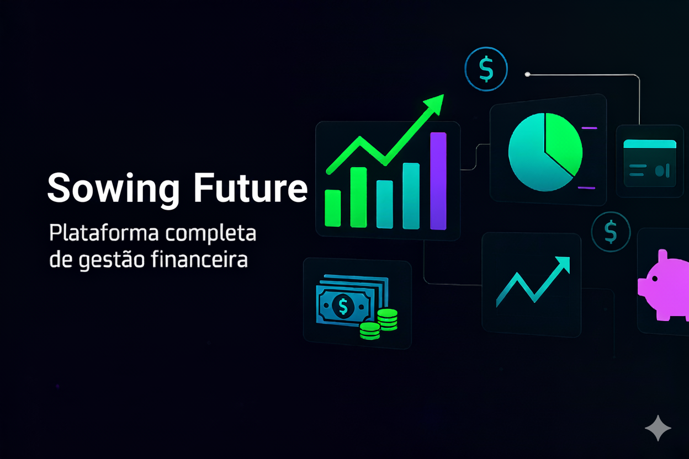

## 1. Descrição do Projeto
O sistema tem como objetivo fornecer uma **plataforma completa de gestão financeira pessoal**, permitindo que os usuários:

- Cadastrem e gerenciem contas de usuário de forma segura.  
- Registrem receitas e despesas, classificadas por tipo e categoria.  
- Criem cofres virtuais com metas financeiras e acompanhem o progresso.  
- Visualizem relatórios financeiros mensais em gráficos e tabelas.  
- Exportem relatórios em PDF ou Excel .  

## 2. Protótipos no Figma
Acesse os protótipos interativos para visualizar o fluxo completo do sistema:

<a href="https://www.figma.com/design/rysLklzzhbRfqDpdR32Ook/BeauMoney?node-id=5-118&t=ZTjS6GvGGGzxTfYL-0" target="_blank">
  💵 Dashboard
</a>

## 3. Tecnologias Utilizadas

### Frontend

### Backend

### Extras

